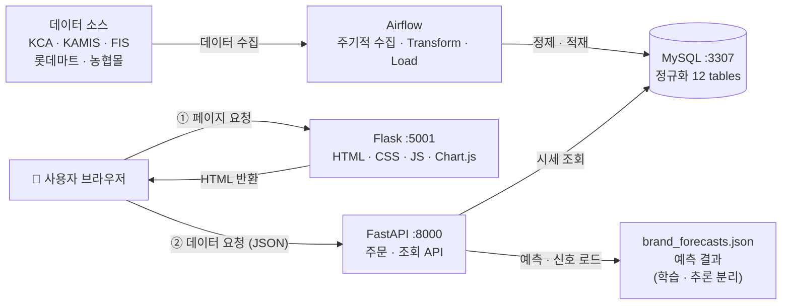
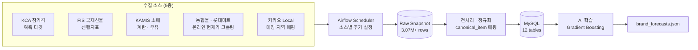
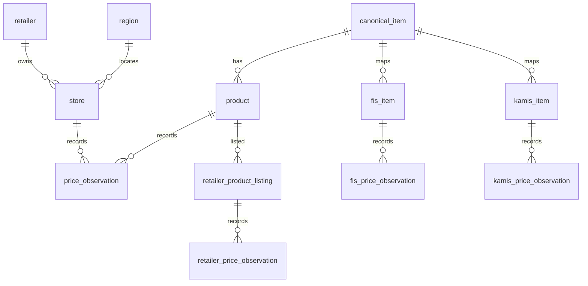
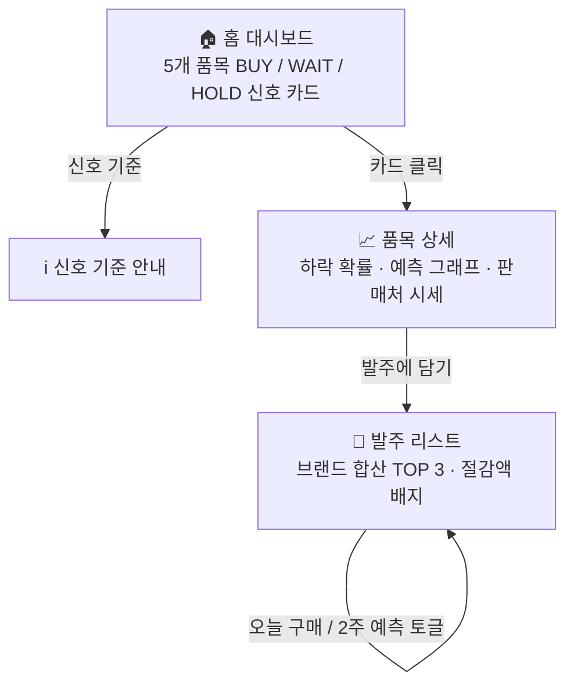

# 🛒 원가레이더 (CostRadar)

> **개인 디저트 카페 사장님을 위한 식자재 원가 예측 · 구매 타이밍 최적화 서비스**
>
> **“지금 사야 유리한가?”와 “어디서 사야 최저가인가?”에 데이터로 답합니다.**

---

## 📑 목차

1. [프로젝트 개요](#1-프로젝트-개요)
2. [핵심 기능](#2-핵심-기능)
3. [시스템 아키텍처](#3-시스템-아키텍처)
4. [데이터 파이프라인 아키텍처](#4-데이터-파이프라인-아키텍처)
5. [AI 모델링](#5-ai-모델링)
6. [사용자 동선](#6-사용자-동선)
7. [API 명세](#7-api-명세)
8. [기술 스택](#8-기술-스택)
9. [주차별 진행 상황](#9-주차별-진행-상황-wbs-실적)
10. [트러블슈팅](#10-트러블슈팅)
11. [성과 & 백테스트](#11-성과--백테스트)
12. [실행 방법](#12-실행-방법)
13. [팀 & 역할](#13-팀--역할)
14. [폴더 구조](#14-폴더-구조)
15. [향후 발전 방향](#15-향후-발전-방향)

---

## 1. 프로젝트 개요

### 문제 정의

대기업과 달리 **별도의 구매팀이 없는 개인 디저트 카페 사장님**은 식자재를 언제, 어디서 구매할지 경험과 감에 의존해 결정하는 경우가 많습니다. 하지만 카페 시장은 이미 높은 경쟁과 폐업 위험에 노출되어 있으며, 식자재 원가 관리의 중요성도 계속 커지고 있습니다.

- 전국 카페 약 **93,000개** · 연 폐업률 **14.1%**
- 서울 카페 5년 생존율 **34.9%**
- **식자재비는 카페 운영비의 약 30~40%** → 원가 관리가 곧 수익성과 직결

### 왜 예측이 필요한가

원재료 국제 가격과 실제 소비자 가격은 같은 방향으로 움직이지 않을 수 있어, 단순한 체감만으로 구매 시점을 판단하기 어렵습니다.

- 2022~2025년 밀 원재료 국제가는 **15% 하락**했지만 국내 밀가루 소비자가는 **20.3% 상승**
- 같은 기간 설탕 소비자가는 **37% 상승**, 유지류 국제가는 1년 사이 **22.7% 상승**

### 서비스가 답하는 2가지 질문

| 질문 | 기능 |
| --- | --- |
| **① 지금 사야 유리한가?** | `BUY / WAIT / HOLD` 구매 타이밍 신호 제공 |
| **② 어떤 구매처 조합이 최저가인가?** | 브랜드 단위 합산 최저가 **TOP 3** 발주 조합 추천 |

---

## 2. 핵심 기능

- **3단계 구매 신호** — `BUY`(선구매) / `WAIT`(관망) / `HOLD`(통상 구매), 하락 확률 기반 판단
- **발주 최적화** — 온라인 배송을 가정하고, 품목마다 판매처를 지나치게 분산하지 않도록 **브랜드 단위 합산 최저가 TOP 3** 추천
- **절감액 가시화** — 최고가 대비 절감 가능한 금액을 `-N원 절감` 형태로 표시

### MVP 범위 & 현실을 반영한 설계 기준

| 구분 | 내용 |
| --- | --- |
| **MVP 품목 5종** | 장기: 밀가루·설탕·버터 (**2~4주 예측**) / 단기: 계란·우유 (**1~2주 예측**) |
| **의도적 제외** | 로그인·JWT, 발주 저장, 지역 필터, 날씨·공휴일 변수 |
| **제외 이유** | 4주 안에 예측과 구매 최적화라는 핵심 가설을 검증하기 위해 부가 기능을 최소화 |

---

## 3. 시스템 아키텍처

화면 제공, API 처리, 데이터 저장의 역할을 분리해 각 계층의 책임을 명확히 하고 변경 영향 범위를 줄이기 위해 **3-Tier 구조**를 적용했습니다.

Flask는 화면 리소스(HTML/CSS/JS)를 제공하고, 브라우저는 FastAPI를 통해 필요한 데이터를 조회합니다. FastAPI는 MySQL의 서비스 데이터와 사전에 생성된 예측 결과를 조회해 JSON 형태로 제공합니다.



<!-- TODO: 포트폴리오용 아키텍처 다이어그램 이미지 완성 후 아래 주석 해제


-->

---

## 4. 데이터 파이프라인 아키텍처

Airflow를 기반으로 각 데이터 소스의 업데이트 주기에 맞춰 수집 작업을 자동화하고, 원본 데이터를 실행 단위로 보관한 뒤 정제·매핑 과정을 거쳐 MySQL에 적재합니다.



### 데이터 규모

| 지표 | 규모 | 의미 |
| --- | ---: | --- |
| **전체 Raw** | **3.07M+ rows** | KCA · FIS · KAMIS · 농협몰 · 롯데마트 통합 |
| **KCA 참가격** | 204,036 obs | 39개 상품 · 466개 매장 · 5개 표준 품목, 예측 타깃 |
| **FIS** | 511건 | 밀 · 설탕 2개 원자재의 국제 선물가 |
| **KAMIS** | 3,291건 | 계란 · 우유 2개 품목의 소매 가격 |
| **온라인 현재가** | 1,336 listings | 농협몰 1,057 + 롯데마트 279 |
| **지역 매칭** | 462 / 462 | 적용 가능 지점 100% 매칭, 전체 466개 기준 99.1% |

> **수집 기간:** 각 데이터 소스 기준 약 1년
>
> KCA `2025.07~2026.07` · FIS `2025.08~2026.07` · KAMIS `2025.05~2026.07`

### ERD

- **표준 품목:** `canonical_item`
- **과거 가격:** `product`, `store`, `price_observation`
- **외부 예측 지표:** `fis_*`, `kamis_*`
- **온라인 현재가:** `retailer_product_listing`, `retailer_price_observation`



<!-- TODO: 전체 ERD 이미지가 있으면 아래 주석 해제


-->

### 입력 / 출력

- **Input**
  - FIS · KAMIS 거시 지표
  - 소매 시계열 `lag_1/2/4`
  - 이동평균 · 이동표준편차
  - 월 계절성 `sin/cos`
- **Output**
  - 2주 뒤 브랜드별 품목 단위당 중위가격
  - 학습 타깃: 직전 대비 가격 변동률

### 의사결정 로직

정규분포 CDF와 `erf`를 이용해 하락 확률을 산출하고, 예측 변동률과 함께 구매 신호를 결정합니다.

| 신호 | 조건 | 의미 |
| --- | --- | --- |
| **BUY** | 하락확률 ≤ 45% **AND** 2주 변동률 ≥ +1.5% | 가격 상승 가능성이 높음 → 선구매 |
| **WAIT** | 하락확률 ≥ 55% **AND** 2주 변동률 ≤ -1.5% | 가격 하락 가능성이 높음 → 관망 |
| **HOLD** | 변동폭 ±1.5% 이내 또는 확률 45~55% | 큰 변동 없음 → 통상 구매 |

---

## 6. 사용자 동선



<!-- TODO: 화면 캡처를 docs/screenshots/ 에 넣고 주석 해제

| 홈 대시보드 | 품목 상세 | 발주 리스트 |
| --- | --- | --- |
|  |  |  |

-->

---

## 7. API 명세

> Swagger: `http://127.0.0.1:8000/docs`

| 메서드 | 엔드포인트 | 하는 일 | 연결 화면 |
| --- | --- | --- | --- |
| `GET` | `/health` | 서버 · DB · 예측 파일 상태 확인 | 상단 연결 배너 |
| `GET` | `/signals` | 품목별 `BUY / WAIT / HOLD` 신호 조회 | 홈 대시보드 |
| `GET` | `/prices/history?item_name=` | 브랜드 평균 가격 시계열 조회 | 품목 상세 |
| `GET` | `/prices/history?item_name=&brand=` | 지점별 가격표 + 최저/평균/최고 조회 | 품목 상세 |
| `POST` | `/predict` | 2주 예측 결과 조회<br/>현재가=DB, 예측가·신호=JSON | 상세 BUY 카드 |
| `POST` | `/orders/quote` | 최근 조사일 평균 단가 조회, 절감액 계산 기준선 제공 | 발주 절감 계산 |
| `POST` | `/optimize/basket` | 브랜드 조합 최저가 TOP 3 계산<br/>`mode=today \| forecast` | 발주 리스트 |

---

## 8. 기술 스택

| 영역 | 사용 기술 |
| --- | --- |
| **데이터 엔지니어링** | Python, Airflow, Playwright, Chromium, Xvfb, xauth, SQLAlchemy Core |
| **AI / ML** | scikit-learn (Gradient Boosting Regressor), pandas, numpy |
| **백엔드** | FastAPI, MySQL 8 |
| **프론트엔드** | Flask, Jinja2, Vanilla JS, Chart.js |
| **인프라** | Docker, Docker Compose |
| **협업 도구** | GitHub, Swagger |

<!-- TODO: AWS 배포·CI/CD를 실제로 구성했다면 인프라 항목에 추가 -->

---

## 9. 주차별 진행 상황 (WBS 실적)

### 1주차 — 기획 · 데이터 파이프라인 구축 · AI 모델링 · 백엔드 인프라 구성

- 서비스 요구사항 정의서 및 화면 와이어프레임 작성
  - 홈 · 상세 · 발주 · 신호 기준 4개 화면
- 공공데이터 및 외부 데이터 수집 스크립트 구현
  - KCA 참가격 · FIS · KAMIS · 카카오 Local
  - 온라인 크롤링: 농협몰 · 롯데마트
- Airflow 기반 배치 수집 자동화
- MySQL 12개 테이블 설계 및 ERD 작성
- 전처리 파이프라인 구현
  - One-Hot Encoding
  - 466개 지점 Target Encoding
  - 시계열 피처 가공
- 가격 예측 모델 개발
  - **Gradient Boosting Regressor** 기반 글로벌 단일 모델
  - LightGBM 경량화 옵션 병행 구현
- FastAPI 기본 엔드포인트 설계
  - `/signals`
  - `/predict`
  - `/optimize/basket`

### 2주차 — AI 모델 고도화 · 풀스택 연동 · 테스트 · 배포 및 발표 준비

- 발주 최적화 로직 구현
  - 브랜드 합산 최저가 TOP 3
- `BUY / WAIT / HOLD` 의사결정 로직 구현
- 학습과 추론 분리
  - 예측 결과를 `brand_forecasts.json`으로 서빙해 운영 안정성 확보
- 프론트엔드 UI 개발
  - Flask + Jinja2 + Chart.js
  - 홈 · 상세 · 발주 3개 주요 화면 구현
- 백엔드-프론트 API 연동
  - 브라우저가 FastAPI를 직접 호출해 JSON 바인딩
  - 미연결 시 예시 데이터 자동 fallback
- 통합 테스트 및 예외 처리
  - **백엔드 미연결 시 화면 공백** → 예시 데이터 자동 fallback + 연결 상태 배너로 UX 보완
  - **Chart.js 그래프 미표시** → 외부 CDN 대신 프로젝트 내부 파일로 전환
- 백테스트 검증
  - 시간순 홀드아웃
  - 절감률 산출
- Docker Compose 기반 멀티 컨테이너 구성
- 포트폴리오용 시스템 아키텍처 및 최종 발표 자료 제작

<!-- TODO: AWS·CI/CD를 실제로 구성했다면 위 항목에 추가 -->

---

## 10. 트러블슈팅

| 문제 | 원인 | 해결 |
| --- | --- | --- |
| **참가격 API 호출 제한** | 개발 계정 트래픽 2,000회 제한 | 실시간 호출 대신 **주기적 배치 수집**으로 전환하고, 1년치 스냅샷을 사전에 확보 |
| **적재 중 오류 발생 시 데이터 정합성 문제** | 적재 도중 오류가 발생하면 일부 데이터만 반영될 가능성 | 부모 → 자식 순서로 적재하고 부모 실패 시 즉시 중단. **Batch 실패 데이터는 별도 CSV로 보관 후 원인 확인 및 재적재** |
| **데이터 소스별 수집 주기 차이** | 각 데이터 소스의 업데이트 주기가 서로 다름 | **Airflow Scheduler**로 소스별 주기 설정. `run_id`로 실행별 Raw 원본을 분리하고 UNIQUE 제약으로 중복 적재 방지 |
| **단순 예측 가격의 한계** | 예상 가격만으로는 실제 구매 시점을 판단하기 어려움 | 과거 변동성을 기반으로 **하락 확률과 80% 신뢰구간**을 계산해 `BUY / WAIT / HOLD` 신호 제공 |
| **제로 분모 및 시장 노이즈** | 변동성 0 계산 오류와 1~2원 수준의 미세 변동에도 신호가 발생 | **최소 변동성 1.5%** 적용 + 변동률·확률 이중 임계값으로 미세 변동은 `HOLD` 처리 |
| **프론트–API 연동 실패** | Flask 화면과 FastAPI 서버가 서로 다른 포트를 사용해 **CORS 차단** 발생 | Flask는 화면을 렌더링하고 브라우저가 FastAPI를 직접 호출하도록 구성. FastAPI CORS 설정에 `:5001` Origin 허용 |
| **발주 추천 결과 분산** | 품목별 최저가만 선택하면 여러 판매처로 주문이 분산됨 | 농협몰 · 롯데마트를 **판매처 단위 총 구매비용**으로 비교해 최소 비용 조합 추천 |
| **상품 가격 비교 왜곡** | 1kg, 900g처럼 용량이 다른 상품을 판매가만으로 비교하면 실제 가격 비교가 왜곡됨 | `unit_price`를 계산해 **kg / L / 10개 기준 단위가격으로 정규화**한 뒤 비교 |
| **그래프 미표시** | Chart.js를 외부 CDN에 의존해 네트워크 상태에 따라 로딩 실패 | Chart.js를 **프로젝트 내부에 포함**해 외부 네트워크 없이 그래프 표시 |
| **API 미연결 시 빈 화면** | API 서버 응답 실패 시 화면에 표시할 데이터가 없음 | **예시 데이터 자동 fallback** + 배너를 통해 실시간 데이터 / fallback 상태 표시 |

---

## 11. 성과 & 백테스트

### 예측 성능

> 시간순 홀드아웃 · 브랜드 모델 Test 966건 기준

| 지표 | 값 |
| --- | ---: |
| **sMAPE** | **0.90%** |
| **MAPE** | 0.97% |
| **MAE** | 40.13원 |
| **RMSE** | 229.49원 |

**품목별 sMAPE / MAE**

- 계란: **0.29% / 16.16원**
- 버터: **0.50% / 124.04원**
- 설탕: **0.55% / 19.84원**
- 우유: **0.95% / 37.08원**
- 밀가루: **1.56% / 29.01원**

### 백테스트 절감률

> 시장 평균가 대비 최적 브랜드 발주 기준

- **5대 품목 평균 절감률 9.70%**
  - 계란 19.84%
  - 설탕 17.52%
  - 버터 6.74%
  - 밀가루 4.33%
  - 우유 0.06%
- 장바구니 최적화: 품목별 최저가 분산 발주 시 **9.28% 절감**
- 25개 조사일 역사적 백테스트: 평균 **4.52% 절감**
  - 회차별 2.98%~7.30%

---

## 12. 실행 방법

> 아래 명령은 표준 Docker Compose 구성 예시입니다. 실제 명령과 환경변수는 레포지토리 구성에 맞게 조정합니다.

```bash
# 1) 레포지토리 클론
git clone https://github.com/Costradar-team/service.git
cd service

# 2) 환경변수 설정 (.env)
# DB 접속 정보, 공공데이터 API 키 등

# 3) 컨테이너 실행
# MySQL :3307 · FastAPI :8000 · Flask :5001 · Airflow :8081
docker-compose up -d
```

### 접속 주소

- **Web:** `http://127.0.0.1:5001`
- **API Docs:** `http://127.0.0.1:8000/docs`

---

## 13. 팀 & 역할

| 역할 | 담당 |
| --- | --- |
| **PM / 기획** | 이정현 |
| **데이터 엔지니어링** | 박채연 |
| **AI / ML** | 정승빈 · 정대원 |
| **백엔드** | 최혜원 |
| **프론트엔드** | 유다연 |

---

## 14. 폴더 구조

```text
service/
├── data-pipeline/              # 원천 데이터 수집 · 품질 검증 · MySQL 적재 파이프라인
│   ├── config/                 # 품목 매핑 룰 및 데이터 품질 검사 설정
│   ├── dags/                   # Airflow DAG
│   ├── scripts/                # ETL 코드
│   │                           # └─ 크롤러 포함 수집 · 전처리 변환 · DB 적재
│   ├── sql/                    # 데이터베이스 초기 DDL 스키마 (테스트용)
│   └── tests/                  # 데이터 수집 및 파이프라인 단위 테스트
│
├── ml/                         # 가격 예측 모델 학습 및 구매 신호 생성 엔진
│   ├── scripts/                # 시계열 피처링 · 학습 · 추론 · 신호 판정
│   └── tests/                  # ML 파이프라인 및 통계 수식 검증 테스트
│
├── backend/                    # FastAPI 기반 비즈니스 로직 및 REST API 서버
│   ├── data/                   # ML 예측 · 신호 결과 데이터셋
│   │                           # └─ brand_forecasts.json
│   └── sql/                    # 프로덕션 운영용 데이터베이스 스키마
│
├── frontend/                   # Flask 기반 대시보드 웹 프론트
│   ├── templates/              # 홈 · 품목 상세 · 지점 시세 · 발주 리스트 UI
│   ├── static/                 # 차트 · 인터랙션 JS · 스타일
│   └── data/                   # 오프라인 시연용 목업 데이터
│
├── artifacts/                  # 파이프라인 실행 중 생성되는 중간 · 최종 산출물
│   ├── data-quality/           # 데이터 프로파일링 및 정제 검증 보고서
│   ├── processed/              # 표준화 완료 통합 가격 데이터셋
│   └── ml/                     # 학습 모델(.joblib) 및 백테스트 결과
│
├── docs/                       # 시스템 아키텍처 문서 및 데이터베이스 ERD
└── scripts/                    # DB 스키마 적용 및 공통 유틸리티 스크립트
```

---

## 15. 향후 발전 방향

- **온라인 현재가 수집 범위 확대**
  - 현재 농협몰 · 롯데마트 → 이마트 등 추가
- **MVP 이후 기능 확장**
  - 지역 필터
  - 발주 리스트 저장
  - 가격 하락 알림
- **외생 변수 추가**
  - 날씨
  - 공휴일
  - 명절 수요
- **LLM 기반 구매 코칭 연동**
  - 예측 신호와 자연어 발주 어드바이스 결합
